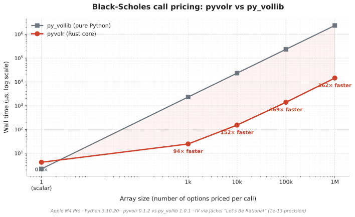

# pyvolr

[](https://pypi.org/project/pyvolr/)
[](https://pypi.org/project/pyvolr/)
[](https://pypi.org/project/pyvolr/#files)
[](https://securityscorecards.dev/viewer/?uri=github.com/yipjunkai/pyvolr)
[](https://github.com/yipjunkai/pyvolr/actions/workflows/ci.yml)
[](#-license)

**Modern Black-Scholes-Merton pricing, Greeks, and implied volatility for Python.** Rust core. Vectorized. Drop-in replacement for the abandoned `py_vollib`.

```python
from pyvolr import bs

bs.price("c", S=100, K=105, T=0.5, r=0.05, sigma=0.2) # 4.581680167540007
```

## ⚡ Performance

<picture>
  <source media="(prefers-color-scheme: dark)" srcset="docs/assets/perf-dark.svg">
  
</picture>

| Scenario                      |   pyvolr | py_vollib | speedup |
| ----------------------------- | -------: | --------: | ------: |
| `bs.price`, scalar            |   4.0 µs |    2.0 µs |    0.5× |
| `bs.price`, 1k strikes        |  25.4 µs |   2.16 ms |     85× |
| `bs.price`, 10k strikes       |   157 µs |  21.73 ms |    139× |
| `bs.price`, 100k strikes      |  1.48 ms | 217.53 ms |    147× |
| `bs.price`, 1M strikes        | 15.18 ms |  2,204 ms |    145× |
| `bs.greeks` (all 5), 10k      |   593 µs |  85.82 ms |    145× |
| `bs.implied_vol`, scalar      |   3.9 µs |   13.9 µs |    3.6× |
| `black76.price`, scalar       |   3.8 µs |    2.2 µs |    0.6× |
| `black76.price`, 10k strikes  |   171 µs |  23.45 ms |    137× |
| `black76.implied_vol`, scalar |   3.9 µs |   15.0 µs |    3.9× |

Vectorize anything you can — that's where pyvolr wins. For a single scalar `price` call, py_vollib's pure-Python path edges out pyvolr because the PyO3 FFI roundtrip + numpy broadcasting setup costs a few microseconds; even a 2-element array call already favors pyvolr. Black-76's profile tracks BSM's exactly because the Rust core delegates to `bsm::price` with `q=r` rather than duplicating math.

Reproduce with `python bench/compare_py_vollib.py`. Numbers above: Apple M4 Pro / Python 3.10.20 / numpy 2.2.6 / pyvolr 0.1.0 vs py_vollib 1.0.1.

## 📦 Install

```bash
pip install pyvolr
```

Or via [`uv`](https://github.com/astral-sh/uv):

```bash
uv pip install pyvolr
```

Pre-built wheels are published for Linux (x86_64, aarch64), macOS (Intel, Apple Silicon), and Windows (x86_64) across Python 3.10–3.14, plus free-threaded builds for 3.13t and 3.14t.

### Tested on

|         | 3.10 | 3.11 | 3.12 | 3.13 | 3.14 |
| ------- | :--: | :--: | :--: | :--: | :--: |
| Linux   |  ✅  |  ✅  |  ✅  |  ✅  |  ✅  |
| macOS   |  ✅  |  ✅  |  ✅  |  ✅  |  ✅  |
| Windows |  —   |  —   |  ✅  |  ✅  |  ✅  |

Every push and PR runs the full `pytest` + `cargo test` suites across the matrix above. Windows × {3.10, 3.11} are skipped intentionally to keep CI minutes reasonable — the wheels themselves still build for those combinations and are published. Free-threaded wheels (3.13t, 3.14t) are built and exercised through `cibuildwheel`'s in-wheel test pass on every release across Linux/macOS/Windows.

From source (requires Rust):

```bash
git clone https://github.com/yipjunkai/pyvolr
cd pyvolr
uv venv --python 3.12 && source .venv/bin/activate
uv pip install -e ".[dev,test]"
maturin develop --release
```

## 🚀 Quick start

```python
import numpy as np
from pyvolr import bs

# Scalar
bs.price("c", S=100, K=105, T=0.5, r=0.05, sigma=0.2)

# Vectorized — broadcast over any combination of inputs
strikes = np.linspace(80, 120, 41)
prices = bs.price("c", S=100, K=strikes, T=0.5, r=0.05, sigma=0.2)

# All five Greeks in one call
greeks = bs.greeks("c", S=100, K=strikes, T=0.5, r=0.05, sigma=0.2)
# {"delta": [...], "gamma": [...], "theta": [...], "vega": [...], "rho": [...]}

# Implied volatility from a market price
bs.implied_vol(price=5.20, flag="c", S=100, K=100, T=0.25, r=0.05)

# Broadcasting works in any dimension
strike_grid = np.linspace(80, 120, 5).reshape(-1, 1)
vol_grid = np.linspace(0.10, 0.40, 4).reshape(1, -1)
surface = bs.price("c", S=100, K=strike_grid, T=0.5, r=0.05, sigma=vol_grid)
# shape (5, 4)

# Black-76 for options on futures / forwards — same API, F replaces S, no q.
from pyvolr import black76
black76.price("c", F=100, K=105, T=0.5, r=0.05, sigma=0.2)
```

## ✨ Features

- **Black-Scholes-Merton pricing** — calls and puts with continuous dividend yield
- **Black-76 pricing** — European options on futures/forwards (`pyvolr.black76`), same vectorized API as `bs`
- **Analytical Greeks** — delta, gamma, theta, vega, rho (with documented sign and unit conventions)
- **Robust implied volatility** — Newton-Raphson seeded by Manaster-Koehler, bisection fallback for OTM tails and tiny-vega regimes
- **Full numpy broadcasting** — any combination of inputs in any shape, scalar-in scalar-out
- **`py_vollib` drop-in shim** — `pyvolr.compat.py_vollib` mirrors the upstream module tree (including `py_vollib.black`) for one-import-line migration
- **Rust core, no compiler needed** — abi3 wheels for Python 3.10–3.14 × {Linux, macOS, Windows}
- **Free-threaded Python ready** — dedicated wheels for 3.13t and 3.14t; the Rust core releases the GIL around the math, so pricing scales across threads without a process pool
- **Typed end-to-end** — pyright-strict library code, full type stubs for the Rust extension

## 🗺️ Coming soon

- [ ] Jäckel "Let's Be Rational" implied volatility (2-iteration convergence)
- [ ] Bachelier (normal model, for negative rates)
- [ ] Higher-order Greeks (vanna, vomma, charm, speed, zomma, color)
- [ ] SIMD batch evaluation + `rayon` parallelism for large arrays
- [ ] American options (CRR binomial → finite difference)
- [ ] Volatility surface fitting (SVI, SSVI)

## 🔄 Migrating from py_vollib

Replace your imports — the signatures and `'c'`/`'p'` flag convention are preserved exactly:

```python
# Before
from py_vollib.black_scholes import black_scholes
from py_vollib.black_scholes.greeks.analytical import delta
from py_vollib.black_scholes.implied_volatility import implied_volatility
from py_vollib.black import black  # futures options

# After
from pyvolr.compat.py_vollib.black_scholes import black_scholes
from pyvolr.compat.py_vollib.black_scholes.greeks.analytical import delta
from pyvolr.compat.py_vollib.black_scholes.implied_volatility import implied_volatility
from pyvolr.compat.py_vollib.black import black  # futures options
```

The compat shim also preserves py_vollib's _unit conventions_: vega is per-1% vol, theta is per-day, rho is per-1% rate, and `implied_volatility` takes `flag` as its last argument. For new code, prefer the modern `pyvolr.bs` API — it accepts numpy arrays, broadcasts naturally, uses per-unit conventions consistently, and returns all Greeks in a single call.

## 🤔 Why pyvolr exists

`py_vollib` has been broken on Python 3.12+ since the release — a transitive dependency imports `DBL_MIN` / `DBL_MAX` from CPython's internal `_testcapi` test module, which isn't shipped with modern Python distributions. The fix is two lines (`sys.float_info.{min,max}` are the correct sources), but `py_lets_be_rational` hasn't released since 2017, `py_vollib` since 2020, and the maintainers are gone.

Full backstory: [docs/why.md](docs/why.md).

## 📁 Project structure

```text
pyvolr/
├── crates/core/             # Rust numerical core
│   └── src/
│       ├── lib.rs           # PyO3 bindings (flat-array entry points)
│       ├── bsm.rs           # BSM pricing, d1/d2, forward price
│       ├── black76.rs       # Black-76 (futures options) — delegates to BSM with q=r
│       ├── greeks.rs        # Delta, gamma, theta, vega, rho
│       ├── iv.rs            # Newton + Manaster-Koehler + bisection IV solver
│       └── normal.rs        # erf-based standard normal CDF / PDF
├── python/pyvolr/
│   ├── bs.py                # BSM public API (numpy-broadcast wrappers)
│   ├── black76.py           # Black-76 public API
│   ├── _core.pyi            # Type stubs for the Rust extension
│   └── compat/py_vollib/    # Drop-in shim mirroring py_vollib's tree
├── tests/                   # pytest + hypothesis property tests
├── .github/workflows/       # ci, release, release-please, differential, fuzz, security, scorecard, stale
├── Cargo.toml               # Rust workspace
└── pyproject.toml           # maturin build backend + project config
```

## 📚 API reference

| Function                                       | Returns                    | Vectorized over        |
| ---------------------------------------------- | -------------------------- | ---------------------- |
| `bs.price(flag, S, K, T, r, sigma, q=0)`       | option price               | all numeric inputs     |
| `bs.delta(flag, S, K, T, r, sigma, q=0)`       | ∂Price/∂S                  | all numeric inputs     |
| `bs.gamma(S, K, T, r, sigma, q=0)`             | ∂²Price/∂S²                | all numeric inputs     |
| `bs.vega(S, K, T, r, sigma, q=0)`              | ∂Price/∂σ (per unit vol)   | all numeric inputs     |
| `bs.theta(flag, S, K, T, r, sigma, q=0)`       | −∂Price/∂T (per year)      | all numeric inputs     |
| `bs.rho(flag, S, K, T, r, sigma, q=0)`         | ∂Price/∂r (per unit r)     | all numeric inputs     |
| `bs.greeks(flag, S, K, T, r, sigma, q=0)`      | `dict` of all five Greeks  | all numeric inputs     |
| `bs.implied_vol(price, flag, S, K, T, r, q=0)` | σ (NaN on bound violation) | price + numeric inputs |
| `black76.price(flag, F, K, T, r, sigma)`       | option price on a forward  | all numeric inputs     |
| `black76.{delta,gamma,vega,theta,rho}(...)`    | Greeks for Black-76        | all numeric inputs     |
| `black76.greeks(flag, F, K, T, r, sigma)`      | `dict` of all five Greeks  | all numeric inputs     |
| `black76.implied_vol(price, flag, F, K, T, r)` | σ (NaN on bound violation) | price + numeric inputs |
| `pyvolr.compat.py_vollib.…`                    | py_vollib-shaped scalars   | n/a (scalar API)       |

`flag` accepts `'c'`/`'C'` (call), `'p'`/`'P'` (put), or an array thereof.

## 🛡️ Sustainability

`py_vollib` died because nobody was paid to maintain it. pyvolr is engineered to outlive its maintainer:

- **One-click releases** via release-please + PyPI Trusted Publishing — PyPI publication needs no stored credentials (OIDC), and release-please authenticates as a repo-scoped GitHub App rather than a user PAT, so the credential survives a maintainer handoff
- **Nightly differential tests** against `py_vollib` on a Python 3.10 sidecar to catch numerical drift
- **Wide CI matrix** (Python 3.10–3.14 × Linux/macOS/Windows) — the specific failure mode that killed the predecessor
- **All GitHub Actions pinned** with weekly Dependabot bumps, hardening against supply-chain attacks
- **Hand-off plan documented** in [GOVERNANCE.md](GOVERNANCE.md)

Commercial sponsorship channels will be added if demand warrants. For now the best support is real-world use, good bug reports, and PRs.

## 🤝 Contributing

See [CONTRIBUTING.md](CONTRIBUTING.md). Particularly welcome: new pricing models (Bachelier, American), higher-order Greeks, SIMD/vectorization work, and property tests for edge cases.

## 📄 License

Dual-licensed under [MIT](LICENSE-MIT) or [Apache 2.0](LICENSE-APACHE), at your option.

Algorithms are reimplemented from published references (Hull, Merton, Manaster-Koehler); no third-party source code is incorporated.
